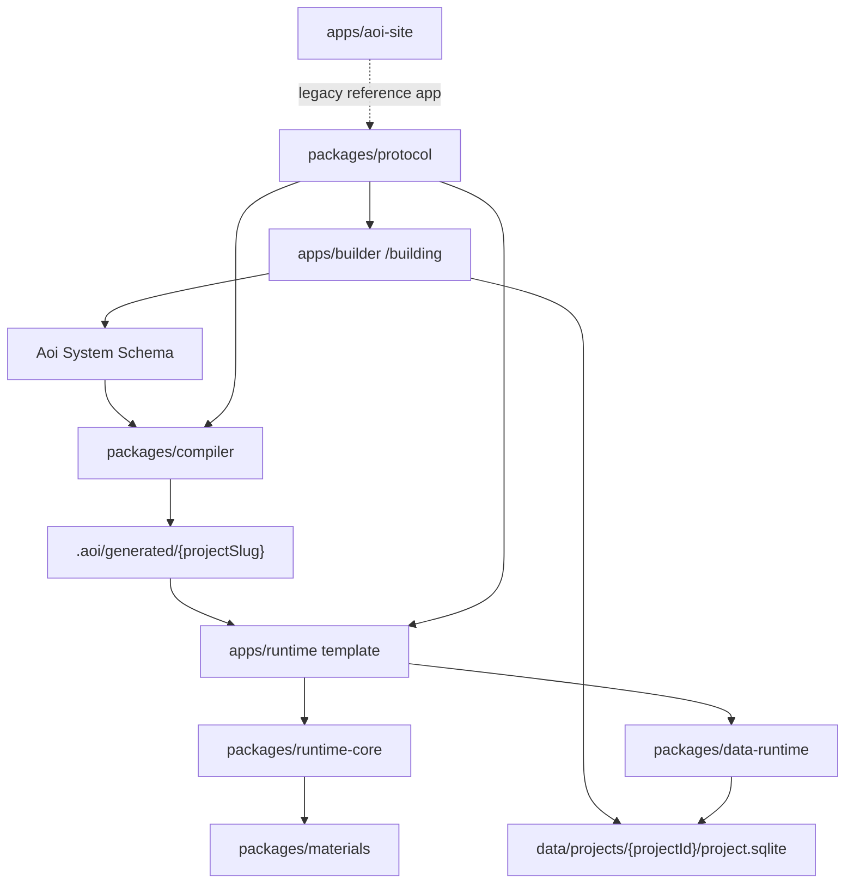

# Aoi Web Workspace

Aoi is being refactored into a Schema-driven low-code self-building platform. The repository is now a pnpm monorepo with a separated construction workspace, a clean runtime template, the migrated legacy Aoi site, and shared protocol/runtime/data/compiler packages.

## Workspace

```text
apps/builder/                 Nuxt builder app, core route: /building
apps/runtime/                 Clean runtime template for generated systems
apps/aoi-site/                Migrated legacy Nuxt video community app
packages/protocol/            Aoi System Schema and public protocol types
packages/materials/           Built-in material manifests and Vue adapters
packages/runtime-core/        Schema renderer and action-flow runtime
packages/data-runtime/        Data driver contract and sqlite-node adapter
packages/compiler/            Schema-to-runtime compiler
packages/templates/admin-crud/ V1 CRUD admin template and seed data
design/rules.md               Long-lived product, architecture, UI, and API rules
```

Generated runtime output is written to `.aoi/generated/{projectSlug}`. Local SQLite project data is written to `data/projects/{projectId}/project.sqlite`. Both directories are ignored by git.

## Commands

```bash
pnpm install
pnpm dev
pnpm dev:builder
pnpm dev:runtime
pnpm dev:aoi-site
pnpm typecheck
pnpm build
pnpm --filter @aoi/compiler compile:admin-crud
```

`pnpm dev` starts `apps/builder`. The default V1 builder project is a generic CRUD admin system with `customers`, `orders`, and `approvalTasks` models backed by Node local SQLite.

There is currently no committed lint script.

## Architecture



## Rules

- `/building` belongs only to `apps/builder`.
- `apps/runtime` and generated output must not depend on `@aoi/builder`.
- SQLite access is server-side only in V1 and must go through `packages/data-runtime`.
- UI never submits arbitrary SQL; tables and CRUD behavior are derived from `AoiModelSchema` and `AoiDataResourceSchema`.
- Larger architecture and UI changes should follow `design/rules.md`.
